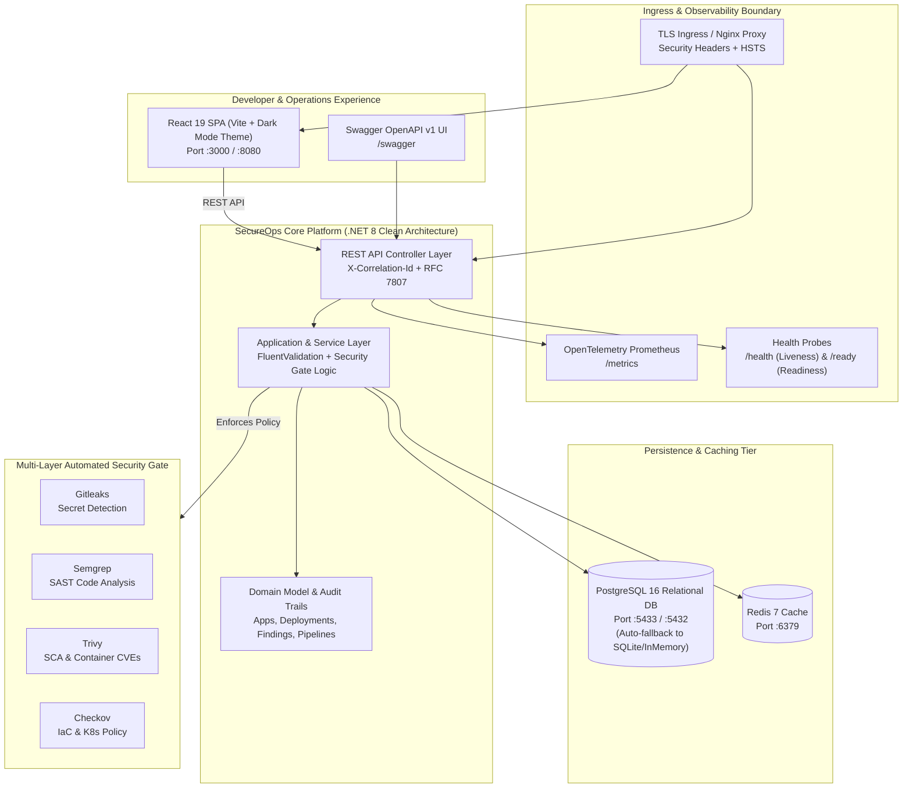

# SecureOps — DevSecOps Reference Platform & Internal Developer Platform (IDP)

[](https://github.com)
[](security/policies/gate-thresholds.md)
[](https://dotnet.microsoft.com/)
[](https://react.dev/)
[](infrastructure/kubernetes/)
[](infrastructure/terraform/)
[](docs/oidc.md)

**SecureOps** is an enterprise-grade DevSecOps Reference Platform and Internal Developer Platform (IDP) demonstrating production-hardened software engineering, shift-left multi-layer security gating, zero-trust container orchestration, and secretless cloud delivery.

---

## 1. System Architecture



---

## 2. Core Architectural Pillars

1. **Zero-Friction Dual-Mode Execution**:
   - **Mode 1 (Host Development)**: Instant local startup with automatic fallback to SQLite (`secureops.db`) or InMemory if PostgreSQL is not running. Zero cloud dependencies required.
   - **Mode 2 (Containerized Fleet)**: Multi-container topology orchestrated via Docker Compose (`docker compose up --build`), with non-root security contexts, isolated ports, and healthy state transitions.
2. **Shift-Left Multi-Layer Security Gating**:
   - Automated 4-tier security scanner execution: **Gitleaks** (Secrets), **Semgrep** (SAST), **Trivy** (Container/SCA), and **Checkov** (IaC).
   - Dynamic gate engine blocks deployments containing unmitigated Critical or High vulnerabilities when targeting production.
3. **Restricted Pod Security Standards (PSS) & Zero-Trust K8s**:
   - Namespaces configured with `pod-security.kubernetes.io/enforce: restricted`.
   - PodSpecs enforce `runAsNonRoot: true`, dedicated UIDs (`10001`/`10101`), `readOnlyRootFilesystem: true`, `capabilities: drop: ["ALL"]`, `seccompProfile: RuntimeDefault`, and `automountServiceAccountToken: false`.
   - `default-deny-all` NetworkPolicies enforce pod-to-pod microsegmentation.
4. **Secretless CI/CD via OIDC Workload Identity**:
   - Eliminates long-lived static cloud keys (`AWS_ACCESS_KEY_ID`, `AWS_SECRET_ACCESS_KEY`) in CI/CD.
   - GitHub Actions exchanges short-lived cryptographic JWT tokens with cloud Security Token Services (STS).
5. **Comprehensive Observability**:
   - End-to-end distributed correlation with `X-Correlation-Id` header propagation.
   - OpenTelemetry metrics exported via Prometheus scraping endpoint at `/metrics`.
   - Structured RFC 7807 `application/problem+json` error envelopes with trace identifiers.

---

## 3. Quick Start Guide

### Prerequisites
- [.NET 8 SDK](https://dotnet.microsoft.com/download) (or .NET 10 SDK with RollForward enabled)
- [Node.js 20+](https://nodejs.org/) & `npm`
- [Docker & Docker Compose](https://www.docker.com/) (for Mode 2)

---

### Mode 1: Host Development (Fastest, Zero-Docker)

1. **Launch the Backend API**:
   ```bash
   dotnet run --project src/SecureOps.Api
   ```
   *The API will start at `http://localhost:5000`. If PostgreSQL is not detected, it automatically initializes a local SQLite database and seeds authentic DevSecOps records.*

2. **Launch the Frontend SPA**:
   ```bash
   cd frontend
   npm install
   npm run dev
   ```
   *The React SPA will start at `http://localhost:5173` with full API proxying.*

3. **Explore Endpoints**:
   - Swagger OpenAPI Documentation: `http://localhost:5000/swagger`
   - OpenTelemetry Prometheus Metrics: `http://localhost:5000/metrics`
   - Liveness Health Probe: `http://localhost:5000/health`
   - Readiness Health Probe: `http://localhost:5000/ready`

---

### Mode 2: Containerized Dev (Docker Compose)

Launch the complete 4-container production-parity environment:
```bash
docker compose up --build -d
```

| Service | Container Name | Host Port | Internal Port | Health Check |
| :--- | :--- | :--- | :--- | :--- |
| **Frontend Web** | `secureops-web` | `http://localhost:3000` | 8080 (unprivileged) | `wget http://127.0.0.1:8080/` |
| **Backend API** | `secureops-api` | `http://localhost:5000` | 5000 | `wget http://localhost:5000/health` |
| **PostgreSQL 16** | `secureops-postgres` | `5433` (avoids local conflict) | 5432 | `pg_isready -U postgres` |
| **Redis 7** | `secureops-redis` | `6379` | 6379 | `redis-cli ping` |

To stop the fleet:
```bash
docker compose down
```

---

## 4. Multi-Layer Security Gate

Run the automated multi-layer security scanner locally to evaluate code against the production release policy:

### PowerShell (Windows):
```powershell
powershell -ExecutionPolicy Bypass -File scripts/security-gate.ps1 -TargetEnvironment Production
```

### Bash (Linux / macOS / CI):
```bash
chmod +x scripts/security-gate.sh
./scripts/security-gate.sh Production
```

### Security Tooling Configuration Files:
- Secret Scanning: [`.gitleaks.toml`](.gitleaks.toml)
- Static Code Analysis (SAST): [`security/semgrep/semgrep-rules.yml`](security/semgrep/semgrep-rules.yml)
- Container & Vulnerability Scanning: [`security/trivy/trivy.yaml`](security/trivy/trivy.yaml)
- Infrastructure-as-Code Scanning: [`security/checkov/.checkov.yml`](security/checkov/.checkov.yml)
- Security Policies & SLA Thresholds: [`security/policies/gate-thresholds.md`](security/policies/gate-thresholds.md)

---

## 5. Automated Testing Suite

The repository includes 55 automated unit, integration, and frontend component tests:

```bash
# 1. Run all Backend Unit Tests (Domain, Validation, Services)
dotnet test tests/SecureOps.UnitTests/SecureOps.UnitTests.csproj

# 2. Run all Backend Integration Tests (Health, Correlation ID, CRUD, Gate, Metrics)
dotnet test tests/SecureOps.IntegrationTests/SecureOps.IntegrationTests.csproj

# 3. Run all Frontend Tests (Vitest + React Testing Library)
cd frontend && npm test
```

### Test Coverage Highlights:
- **Unit Tests (34 tests)**: Domain entity lifecycle, FluentValidation rules, business gate logic, finding triage transitions, audit logging.
- **Integration Tests (11 tests)**: `CustomWebApplicationFactory` in-memory test host, `X-Correlation-Id` propagation, RFC 7807 problem details, database seeding, `/health` and `/ready` probes.
- **Frontend Tests (10 tests)**: API client error handling, `SeverityBadge`, `StatusBadge`, and `MetricCard` rendering.

---

## 6. Kubernetes Deployment (Kustomize Base + Overlays)

Hardened Kubernetes manifests with restricted Pod Security Standards:

```bash
# Validate Base Manifests
kubectl kustomize infrastructure/kubernetes/base

# Validate Development Overlay (single replica, dev config)
kubectl kustomize infrastructure/kubernetes/overlays/dev

# Validate Production Overlay (3 replicas, HPA, PDB, enhanced resource limits)
kubectl kustomize infrastructure/kubernetes/overlays/prod
```

---

## 7. Terraform Infrastructure as Code (IaC)

Modular, CIS-compliant Terraform modules provisioning multi-tier cloud infrastructure:

```bash
cd infrastructure/terraform/environments/local
terraform init -backend=false
terraform validate
```

Modules include:
- `modules/networking`: 3-tier VPC with public, private app, and isolated database subnets, NAT gateways, and VPC Flow Logs.
- `modules/compute`: Hardened EKS cluster with KMS secret envelope encryption, IMDSv2 enforcement, and private control plane endpoints.
- `modules/database`: Managed PostgreSQL RDS instance with KMS storage encryption, forced SSL/TLS (`rds.force_ssl = 1`), and private security groups.

---

## 8. REST API Specification

| Method | Endpoint | Description |
| :--- | :--- | :--- |
| `GET` | `/health` | Liveness health probe (`{"status":"Healthy"}`) |
| `GET` | `/ready` | Readiness health probe (validates database connection) |
| `GET` | `/metrics` | Prometheus metrics scraping endpoint |
| `GET` | `/api/dashboard/metrics` | Platform overview KPIs, recent deployments, and security scores |
| `GET` | `/api/applications` | List registered microservices with health statuses |
| `GET` | `/api/applications/{id}` | Detailed microservice overview with pipeline history and open findings |
| `POST` | `/api/applications` | Register a new application service in the IDP |
| `GET` | `/api/deployments` | List deployment audit records with filtering |
| `POST` | `/api/deployments` | Trigger a new deployment (enforces automated Security Gate) |
| `POST` | `/api/deployments/{id}/rollback` | Execute an automated rollback to a previous version |
| `GET` | `/api/security/findings` | Query security findings by severity, status, tool, or app |
| `GET` | `/api/security/summary` | Aggregate vulnerability counts across critical, high, medium, low |
| `POST` | `/api/security/findings/{id}/triage` | Triage a security finding (Resolved, FalsePositive, Suppressed) |

---

## 9. Architecture Decision Records (ADRs) & Documentation

- [ADR-001: Zero-Friction Dual-Mode Execution Architecture](docs/adr/ADR-001-dual-mode-execution.md)
- [ADR-002: Multi-Layer Security Gating & Shift-Left DevSecOps](docs/adr/ADR-002-multi-layer-security-gating.md)
- [ADR-003: Zero-Secret CI/CD via OIDC Workload Identity](docs/adr/ADR-003-oidc-workload-identity.md)
- [ADR-004: Kubernetes Pod Security Standards & Zero-Trust Policies](docs/adr/ADR-004-kubernetes-pod-security-standards.md)
- [ADR-005: OpenTelemetry Observability & Correlation Propagation](docs/adr/ADR-005-opentelemetry-observability.md)
- [STRIDE Threat Model & Security Risk Assessment](docs/threat-model.md)
- [OIDC Workload Identity Architecture Guide](docs/oidc.md)
- [Security Gate Policies & SLA Thresholds](security/policies/gate-thresholds.md)

---

## 10. License
This reference platform is open source software licensed under the [MIT License](LICENSE).
