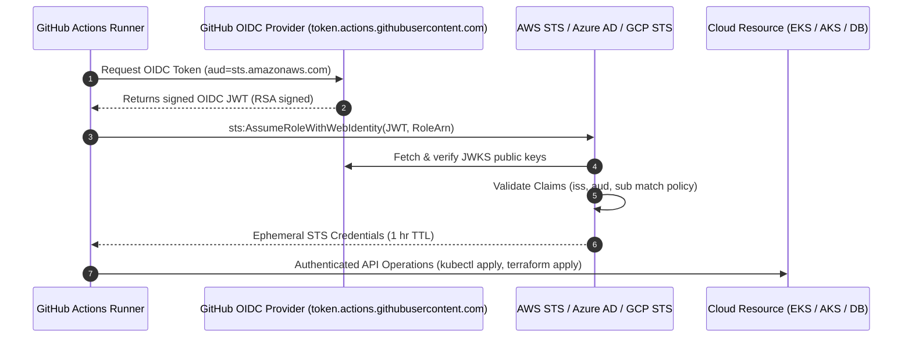

# OIDC Workload Identity Architecture & Zero-Secret CI/CD

## 1. Executive Summary & Problem Statement

Historically, continuous integration and deployment (CI/CD) pipelines authenticated to public clouds (AWS, Azure, GCP) using **static, long-lived credentials** (e.g., `AWS_ACCESS_KEY_ID` and `AWS_SECRET_ACCESS_KEY` or Azure Service Principal client secrets).

This legacy model presents severe security risks:
- **Credential Leakage**: Secrets committed to git history, leaked in build logs, or exposed via compromised runner dependencies.
- **Excessive Blast Radius**: Static credentials rarely have short TTLs; compromised keys often remain valid for months or years.
- **Operational Burden**: Mandatory 90-day credential rotation cycles cause pipeline outages and administrative overhead.

**SecureOps implements OpenID Connect (OIDC) Workload Identity Federation**. GitHub Actions obtains an ephemeral cryptographic JWT token directly from GitHub's OIDC Provider (`https://token.actions.githubusercontent.com`), which the cloud provider verifies to grant temporary, scoped credentials (typically valid for 1 hour). **Zero static cloud secrets exist in GitHub repository settings.**

---

## 2. OIDC Token Exchange Sequence



---

## 3. GitHub Actions OIDC Claims Deep-Dive

GitHub sends signed JSON Web Tokens containing contextual claims about the running workflow. A decoded SecureOps workflow JWT looks like:

```json
{
  "iss": "https://token.actions.githubusercontent.com",
  "aud": "sts.amazonaws.com",
  "sub": "repo:organization/SecureOps:ref:refs/heads/main",
  "repository": "organization/SecureOps",
  "repository_owner": "organization",
  "environment": "production",
  "ref": "refs/heads/main",
  "sha": "7a9b3c4d5e6f1a2b3c4d5e6f",
  "workflow": "Kubernetes CD & Deployment Gate",
  "actor": "devops-engineer"
}
```

### Critical Security Claims:
- `iss` (Issuer): Guarantees the token was issued by GitHub's official identity provider.
- `aud` (Audience): Audience configured in cloud trust relationship (e.g., `sts.amazonaws.com`).
- `sub` (Subject): **The primary security boundary**. Specifies repository, branch, tag, or environment.

---

## 4. Cloud Provider Trust Policy Specifications

### A. Amazon Web Services (AWS IAM Role Trust Policy)

```json
{
  "Version": "2012-10-17",
  "Statement": [
    {
      "Effect": "Allow",
      "Principal": {
        "Federated": "arn:aws:iam::123456789012:oidc-provider/token.actions.githubusercontent.com"
      },
      "Action": "sts:AssumeRoleWithWebIdentity",
      "Condition": {
        "StringEquals": {
          "token.actions.githubusercontent.com:aud": "sts.amazonaws.com"
        },
        "StringLike": {
          "token.actions.githubusercontent.com:sub": [
            "repo:organization/SecureOps:environment:production",
            "repo:organization/SecureOps:ref:refs/heads/main"
          ]
        }
      }
    }
  ]
}
```

> [!CAUTION]
> **Never use wildcard subjects (`sub: "*"`)!** A wildcard subject permits ANY GitHub user on any public or private repository across all of GitHub to assume your cloud role and compromise your infrastructure. Always pin `repo:organization/repository-name:*`.

---

### B. Microsoft Azure (User-Assigned Managed Identity)

In Azure, Federated Identity Credentials link Azure Managed Identities to GitHub OIDC:
- **Name**: `secureops-prod-gh-actions`
- **Issuer**: `https://token.actions.githubusercontent.com`
- **Subject Identifier**: `repo:organization/SecureOps:environment:production`
- **Audience**: `api://AzureADTokenExchange`

---

### C. Google Cloud Platform (Workload Identity Federation)

```bash
# Create Workload Identity Pool and Provider
gcloud iam workload-identity-pools providers create-oidc "github-provider" \
  --project="secureops-project" \
  --location="global" \
  --workload-identity-pool="secureops-pool" \
  --issuer-uri="https://token.actions.githubusercontent.com" \
  --attribute-mapping="google.subject=assertion.sub,attribute.repository=assertion.repository" \
  --attribute-condition="assertion.repository == 'organization/SecureOps'"
```

---

## 5. GitHub Actions Workflow Implementation

To exchange OIDC tokens in GitHub Actions, the workflow job MUST explicitly declare `permissions: id-token: write`:

```yaml
name: Deploy Production Workload

on:
  push:
    branches: [main]

permissions:
  id-token: write  # Mandatory for requesting the OIDC token
  contents: read

jobs:
  deploy:
    runs-on: ubuntu-latest
    environment: production
    steps:
      - name: Checkout Code
        uses: actions/checkout@v4

      # AWS OIDC Authentication (No static access keys required)
      - name: Configure AWS Credentials via OIDC
        uses: aws-actions/configure-aws-credentials@v4
        with:
          role-to-assume: arn:aws:iam::123456789012:role/SecureOpsProductionDeployerRole
          role-session-name: GitHubActions-${{ github.run_id }}
          aws-region: us-east-1

      - name: Deploy Kubernetes Manifests
        run: |
          aws eks update-kubeconfig --name prod-secureops-cluster --region us-east-1
          kubectl apply -k infrastructure/kubernetes/overlays/prod
```

---

## 6. Auditability & Compliance

1. **CloudTrail / Azure Activity Log**: Every role assumption is recorded with:
   - Full GitHub Run ID and repository name.
   - Triggering commit SHA and branch reference.
   - Actor (username of the developer who initiated the push or approved the PR).
2. **SOC 2 & ISO 27001 Alignment**: Satisfies CC6.1 (Logical Access Controls), CC6.3 (Least Privilege Access), and eliminates non-compliance findings related to static privileged API keys.
