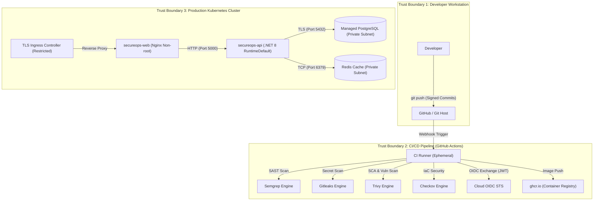

# SecureOps STRIDE Threat Model & Security Risk Assessment

## 1. Scope & System Architecture Overview

The SecureOps DevSecOps Reference Platform is designed to manage microservice cataloging, continuous delivery pipelines, automated security scanning, and production deployment gates.

This threat model applies the **STRIDE** methodology (Spoofing, Tampering, Repudiation, Information Disclosure, Denial of Service, Elevation of Privilege) to analyze threat actors, attack surfaces, and defensive controls across the software delivery lifecycle.

---

## 2. Threat Actor Taxonomy

| Actor Profile | Capabilities & Motivation | Target Vector |
| :--- | :--- | :--- |
| **Malicious External Attacker** | Opportunistic vulnerability scanning, credential stuffing, automated bots | Public Ingress, REST API endpoints, API authentication |
| **Compromised Dependency (Supply Chain)** | Malicious package update in npm/NuGet ecosystem, backdoored base images | CI build runners, application memory, container runtime |
| **Malicious Insider / Compromised Dev** | Valid developer credentials, access to internal repositories and PR review | Code injection, bypassing security gate, tampering with audit logs |
| **Stolen CI/CD Token** | Intercepted CI/CD webhook secret or ephemeral runner token | Infrastructure manipulation, unauthorized cloud provisioning |

---

## 3. Data Flow Diagram (DFD) & Trust Boundaries

---

## 4. STRIDE Threat Assessment & Mitigation Matrix

### A. Spoofing (Identity & Authentication)

| Threat ID | Threat Scenario | Impact | Severity | Implemented Mitigation in SecureOps | Residual Risk |
| :--- | :--- | :--- | :--- | :--- | :--- |
| **T-SP-01** | Attacker spoofs identity in CI/CD pipeline using stolen long-lived cloud keys | Cloud account takeover, unauthorized resource provisioning | **CRITICAL** | **OIDC Workload Identity Federation** eliminates static cloud credentials. Roles are strictly bound to `repo:org/SecureOps:environment:production`. | Low (GitHub token signing infrastructure compromise). |
| **T-SP-02** | Rogue container pods impersonate backend API services to query database | Data theft, malicious transaction injection | **HIGH** | **Kubernetes NetworkPolicies** strictly enforce zero-trust pod-to-pod microsegmentation. Database accepts traffic solely from `secureops-api` pods on port 5432. | Low (Kernel namespace escape). |
| **T-SP-03** | Fake triage approvals forged in security finding reports | Concealing critical vulnerabilities to force production release | **HIGH** | `TriageFindingRequestValidator` mandates authorized email identity; each action logs immutable `AuditLogEntity` with user context. | Low (Compromised authorized user account). |

---

### B. Tampering (Data & Pipeline Integrity)

| Threat ID | Threat Scenario | Impact | Severity | Implemented Mitigation in SecureOps | Residual Risk |
| :--- | :--- | :--- | :--- | :--- | :--- |
| **T-TM-01** | Malicious commit modifies application code to introduce SQL Injection or Backdoor | Remote code execution, database compromise | **CRITICAL** | **Automated Semgrep SAST** scanning enforces rule `csharp-ef-raw-sql-concatenation` and blocks PR merge via GitHub Actions. | Low (Novel zero-day syntax bypass). |
| **T-TM-02** | Build runner alters compiled artifacts or injects malicious binaries into container image | Backdoored production container running in production | **CRITICAL** | Multi-stage Docker builds execute inside ephemeral GitHub runners; images are scanned with **Trivy** before deployment; K8s `imagePullPolicy: Always`. | Low (Vulnerability in Docker daemon). |
| **T-TM-03** | In-flight request tampering between web client and backend API | Session hijacking, parameter manipulation | **HIGH** | Mandatory TLS termination at Ingress with HSTS (`Strict-Transport-Security: max-age=31536000`), secure cookies, and CORS origin whitelisting. | Negligible. |

---

### C. Repudiation (Accountability & Audit Trails)

| Threat ID | Threat Scenario | Impact | Severity | Implemented Mitigation in SecureOps | Residual Risk |
| :--- | :--- | :--- | :--- | :--- | :--- |
| **T-RP-01** | Developer overrides security gate or triggers rollback and denies taking the action | Inability to audit security incident origin or assign accountability | **MEDIUM** | Centralized `AuditLogEntity` logs every deployment, application creation, and triage override with timestamp, user identity, and change diff. | Low (Database admin direct row tampering). |
| **T-RP-02** | Requests through API cannot be traced to specific user sessions | Obfuscated attacker reconnaissance | **MEDIUM** | `CorrelationIdMiddleware` assigns or propagates `X-Correlation-Id` across every request, logs with Serilog, and exposes in OpenTelemetry traces. | Negligible. |

---

### D. Information Disclosure (Confidentiality & Secrets)

| Threat ID | Threat Scenario | Impact | Severity | Implemented Mitigation in SecureOps | Residual Risk |
| :--- | :--- | :--- | :--- | :--- | :--- |
| **T-ID-01** | Hardcoded secrets committed to git repository (database passwords, API keys) | Credential compromise, database unauthorized access | **CRITICAL** | **Gitleaks** runs in pre-commit and CI workflows using `.gitleaks.toml`; custom high-entropy rules reject commits containing secrets. | Low (Unknown low-entropy custom token formats). |
| **T-ID-02** | Sensitive database records intercepted during transmission | Data eavesdropping on internal VPC network | **HIGH** | PostgreSQL enforces TLS encryption in transit (`rds.force_ssl = 1`), and storage encryption at rest with customer-managed **AWS KMS** keys. | Negligible. |
| **T-ID-03** | Verbose error stack traces leaked to client in production | Internal implementation disclosure, reconnaissance aid | **MEDIUM** | `ExceptionHandlingMiddleware` catches unhandled exceptions, logs full trace internally with Serilog, and outputs clean RFC 7807 `ProblemDetails` JSON. | Negligible. |

---

### E. Denial of Service (Availability)

| Threat ID | Threat Scenario | Impact | Severity | Implemented Mitigation in SecureOps | Residual Risk |
| :--- | :--- | :--- | :--- | :--- | :--- |
| **T-DS-01** | Traffic surge or CPU-exhaustion attack crashes API containers | Service outage, inability to deploy critical fixes | **HIGH** | Kubernetes **HorizontalPodAutoscaler (HPA)** scales pods from 3 to 10 based on CPU (75%) and Memory (80%); **PodDisruptionBudget (PDB)** guarantees minAvailable 2. | Low (Upstream infrastructure saturation). |
| **T-DS-02** | Container memory leak exhausts Kubernetes worker node memory | Node OOM crash, disruption to co-located workloads | **HIGH** | Explicit CPU and Memory `requests` and `limits` configured on all Kubernetes Deployment PodSpecs; container runtimes killed before host exhaustion. | Low. |

---

### F. Elevation of Privilege (Access Control & Boundaries)

| Threat ID | Threat Scenario | Impact | Severity | Implemented Mitigation in SecureOps | Residual Risk |
| :--- | :--- | :--- | :--- | :--- | :--- |
| **T-EP-01** | Compromised web container attempts root breakout or host filesystem modification | Host node takeover, container breakout | **CRITICAL** | Container `securityContext` enforces `runAsNonRoot: true`, unprivileged UID (`10001` / `10101`), `readOnlyRootFilesystem: true`, `allowPrivilegeEscalation: false`, `capabilities: drop: ["ALL"]`, and `seccompProfile: RuntimeDefault`. | Low (Kernel zero-day container escape). |
| **T-EP-02** | Pod accesses AWS Instance Metadata Service (IMDS) to steal host EC2 node credentials | Complete AWS cloud account compromise | **CRITICAL** | EC2 launch templates enforce **IMDSv2** (`http_tokens = "required"`, `http_put_response_hop_limit = 1`), preventing bridged containers from querying metadata. | Negligible. |
| **T-EP-03** | Default service account token mounted into pod used to query Kubernetes API | Cluster enumeration and privilege escalation | **HIGH** | `automountServiceAccountToken: false` set on all Kubernetes Deployment PodSpecs. Pods cannot authenticate to Kubernetes API server. | Negligible. |

---

## 5. Security Posture Summary & Verification

| Security Domain | Defensive Technique | Automated Verification Tool |
| :--- | :--- | :--- |
| **Code & SAST** | Pattern matching, tainted data flow | Semgrep (`security/semgrep/semgrep-rules.yml`) |
| **Secret Management** | High-entropy regex, git history analysis | Gitleaks (`.gitleaks.toml`) |
| **Supply Chain & CVEs** | Dependency vulnerability scanning | Trivy (`security/trivy/trivy.yaml`) |
| **Infrastructure as Code** | Policy-as-Code checks, CIS Benchmark | Checkov (`security/checkov/.checkov.yml`) |
| **Container Hardening** | Non-root UID, read-only rootfs, drop capabilities | Pod Security Standards (`restricted`), Checkov |
| **Identity & Access** | Cryptographic token exchange (OIDC) | GitHub Actions OIDC + Cloud STS |
