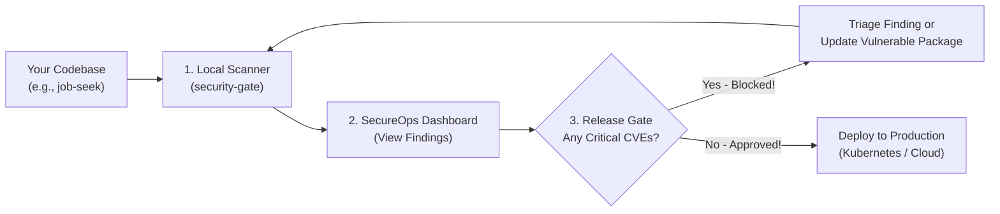

# SecureOps User Guide: Getting Started with Your Projects

Welcome to **SecureOps**! If you are a developer, tech lead, or DevOps engineer wondering:
> *"What does this platform do for me, and how do I actually use it on my own projects?"*

This guide walks you through everything step-by-step with practical examples.

---

## 1. The Simple Analogy: What is SecureOps?

Imagine your company builds multiple web applications (e.g., an auth service, an online store, a job portal like `job-seek`, a doctor booking app like `doc-appoint`).

Before SecureOps, every project:
- Had secrets scattered in random `.env` files.
- Used outdated npm or NuGet packages with unknown security bugs.
- Deployed to production without checking if code had SQL injection or leaked API keys.
- Required manual approval spreadsheets or Slack messages before deploying.

**SecureOps is your automated security and deployment control tower:**
1. It scans your code for **leaked passwords**, **code bugs (SAST)**, **outdated packages (CVEs)**, and **cloud misconfigurations**.
2. It gives you a **central web portal** where you can see all your company's microservices, their health, and their vulnerabilities.
3. It acts as an **Automated Security Bouncer (Gate)**:
   - If your project has **zero critical bugs**, it approves your deployment to Production.
   - If someone accidentally leaves an RCE exploit or hardcoded secret in the code, SecureOps **blocks the release** so customers are never compromised.

---

## 2. The Complete Workflow (From Code to Production)



---

## 3. Step-by-Step Tutorial: Using SecureOps on Your Project

Let's walk through how a first-time user takes an existing project (like `job-seek`) and plugs it into SecureOps.

### Step 1: Open the SecureOps Portal

Make sure SecureOps is running (either via `docker compose up -d` or `dotnet run` / `npm run dev`):
- Open your browser to: **`http://localhost:3000`** (or `http://localhost:5173` in dev mode).
- You will see the **SecureOps Command Center** with active microservices, security score, and recent activity.

---

### Step 2: Register Your Application

1. Click on **Applications** in the left sidebar.
2. Click **+ Register New Service**.
3. Fill out your project details:
   - **Service Name**: `job-seek` (or your project's name)
   - **Repository URL**: `https://github.com/your-username/job-seek`
   - **Owner Email**: `you@company.com`
   - **Language / Framework**: `Node.js / Express + React`
   - **Tier**: Select `Tier 2 (Business Core)`
4. Click **Register Service**.
   > Your application is now tracked in the platform with an assigned UUID and health monitoring!

---

### Step 3: Run the Security Scanner on Your Project

Before shipping any feature, run the multi-layer security scanner on your local project directory.

Open your terminal in your project's folder (e.g. `c:\Users\sirki\projects\job-seek`):

#### On Windows (PowerShell):
```powershell
# Copy the gate script from SecureOps (one-time):
Copy-Item "c:\Users\sirki\projects\SecureOps\scripts\security-gate.ps1" .

# Run the scan:
powershell -ExecutionPolicy Bypass -File .\security-gate.ps1 -TargetEnvironment Production
```

#### On Linux / macOS (Bash):
```bash
# Copy the gate script from SecureOps (one-time):
cp /path/to/SecureOps/scripts/security-gate.sh .
chmod +x ./security-gate.sh

# Run the scan:
./security-gate.sh Production
```

#### What the scan does automatically:
1. **Checks Secrets (Gitleaks)**: Checks if any passwords, Stripe keys, or database credentials were accidentally committed.
2. **Checks Source Code (Semgrep)**: Scans JavaScript/TypeScript/Python/C# for SQL injection, path traversal, XSS, or broken crypto.
3. **Checks Dependencies (Trivy)**: Scans `package.json` or `package-lock.json` for known CVEs.
4. **Checks Cloud Files (Checkov)**: Scans Dockerfiles or Terraform configs for security misconfigurations.

---

### Step 4: View Vulnerabilities & Metrics in the Web Portal

1. Go back to the SecureOps web portal at **`http://localhost:3000`**.
2. Click **Security Findings** in the left sidebar.
3. You will see an organized table of all vulnerabilities detected across your projects:
   - **Critical / High / Medium / Low** severity badges.
   - The file and line number where the issue occurred.
   - Remediation guidance (e.g. *"Update `multer` to version 2.1.1"*).

---

### Step 5: Test the Production Deployment Gate

Now see the platform's core power: **Guarding your production environment**.

1. In the portal, click **Deployments** -> **New Deployment**.
2. Select:
   - **Application**: `job-seek`
   - **Environment**: `Production`
   - **Version**: `v1.0.0`
3. Click **Deploy**:
   - If your project has an unmitigated **Critical vulnerability**, the gate status will immediately turn **FAILED** with the message:
     > *"Deployment blocked by Security Gate: 1 critical security finding must be remediated or triaged before production release."*
   - If you deploy to **Development**, the system **permits the deployment** so developers can test and debug.

---

### Step 6: Triage or Remediate the Issue

When a deployment is blocked, developers have two options:

#### Option A: Fix the Code / Update the Package (Recommended)
- Run `npm update <package>` or fix the vulnerable code line.
- Re-run `.\security-gate.ps1`. When clean, retry the deployment -> **Succeeded**!

#### Option B: Triage as False Positive or Temporary Exception
If a finding is a known false positive or approved exception:
1. Click on the finding in the **Security Findings** tab.
2. Click **Triage Finding**.
3. Select `FalsePositive` or `Suppressed`.
4. Enter your email and justification note (e.g. *"Compensating control: AWS WAF rule active"*).
5. Submit. SecureOps records an immutable audit log and unblocks the gate!

---

## 4. How to Automate This in GitHub (CI/CD)

To make this happen automatically every time someone opens a Pull Request in your project:

1. In your project repository (e.g. `job-seek`), create a folder: `.github/workflows/`.
2. Copy [`.github/workflows/security.yml`](../.github/workflows/security.yml) into that folder.
3. Now, whenever you or a team member pushes code:
   - GitHub Actions automatically runs Gitleaks, Semgrep, Trivy, and Checkov.
   - Any vulnerabilities appear right on the GitHub Pull Request page.
   - The PR cannot be merged into `main` if the security gate fails.

---

## 5. Summary: What Your Projects Gain

| What You Had Before | What You Have with SecureOps |
| :--- | :--- |
| Secrets accidentally committed to GitHub | **Gitleaks** blocks secret commits before push |
| Outdated libraries with known exploits | **Trivy** flags unpatched CVEs with the exact fixed version |
| Unsafe code patterns (SQL injection, Path Traversal) | **Semgrep** detects code flaws with line numbers |
| Risky root containers in Kubernetes | **PSS Restricted** policies enforce non-root security |
| Static AWS passwords stored in GitHub | **OIDC Workload Identity** with 1-hour ephemeral tokens |
| No visibility into what is running where | **Centralized IDP Web Dashboard** with audit trails |
