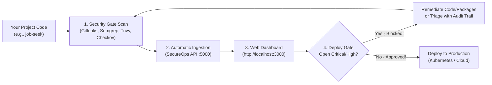

# SecureOps User Guide: Getting Started with Your Projects

Welcome to **SecureOps**! If you are a developer, tech lead, or DevOps engineer wondering:
> *"What does this platform do for me, and how do I actually use it on my own projects (like `job-seek`, `doc-appoint`, or new repositories)?"*

This guide walks you through everything step-by-step with practical examples, real-world scan outputs, and troubleshooting tips.

---

## 1. The Simple Analogy: What is SecureOps?

Imagine your organization builds multiple web applications (e.g., an auth service, an online store, a job portal like `job-seek`, a doctor booking app like `doc-appoint`).

Before SecureOps, every project:
- Had secrets scattered in random `.env` files.
- Used outdated npm or NuGet packages with unknown security bugs.
- Deployed to production without checking if code had SQL injection or leaked API keys.
- Required manual approval spreadsheets or Slack messages before deploying.

**SecureOps is your automated security and deployment control tower:**
1. It scans your code across 4 layers: **leaked secrets**, **source code flaws (SAST)**, **vulnerable dependencies (CVEs)**, and **cloud misconfigurations (IaC)**.
2. It automatically syncs findings to a **central web portal** (`http://localhost:3000`) where you can see all your company's microservices, their health status, and their open vulnerabilities.
3. It acts as an **Automated Security Bouncer (Gate)**:
   - If your project has **zero critical or high-risk bugs**, it approves your deployment to Production.
   - If someone accidentally leaves an RCE exploit or hardcoded secret in the code, SecureOps **blocks the release** so customers are never compromised.
   - In Development environments, it allows deployments with warnings so developers can debug freely.

---

## 2. The Complete Workflow (From Code to Production)



---

## 3. Step-by-Step Tutorial: Scanning Any Project

### Step 1: Ensure SecureOps is Running

Before running scans, make sure the SecureOps stack is running:

```powershell
# In the SecureOps directory:
docker compose up -d
```

Verify that the services are healthy:
- **Web Portal**: [http://localhost:3000](http://localhost:3000)
- **Backend API**: [http://localhost:5000](http://localhost:5000) (Health check: [http://localhost:5000/health](http://localhost:5000/health))

---

### Step 2: Run the Security Scanner on Your Project

You have two convenient ways to scan any project on your computer:

#### Option A: Run from the SecureOps directory (No copying needed!)
Specify the `-ProjectPath` argument pointing to your project:
```powershell
cd ./SecureOps
powershell -ExecutionPolicy Bypass -File .\scripts\security-gate.ps1 -ProjectPath "\job-seek" -TargetEnvironment Production
```

#### Option B: Run directly from inside your project folder
You can copy `security-gate.ps1` into your project folder and run it:
```powershell
cd./job-seek
powershell -ExecutionPolicy Bypass -File .\security-gate.ps1 -TargetEnvironment Production
```

> **Smart Configuration Resolution**: The script automatically locates rules from the central SecureOps installation (`.gitleaks.toml`, `semgrep-rules.yml`, `trivy.yaml`, `.checkov.yml`) or falls back cleanly to engine defaults. You do **not** need to copy any config files!

> **Interactive Onboarding**: If the application has not been registered in the SecureOps portal yet, `security-gate.ps1` automatically detects your project's Git repository URL, owner email, and tech stack, and prompts you to confirm or customize the details (Press `[Enter]` to accept defaults). In CI/CD pipelines, pass `-NonInteractive` to onboard automatically without user prompts!

---

### Step 3: Understand What the Security Gate Checks

When the script runs, it evaluates four security tiers:

| Tier | Tool | What It Scans | Policy Enforcement |
| :--- | :--- | :--- | :--- |
| **1. Secrets** | **Gitleaks** | Leaked JWT secrets, API keys, database credentials in `.env`, commits, or files | **Zero-Tolerance**: Any secret immediately blocks Production |
| **2. SAST** | **Semgrep** | Code-level flaws: SQL injection, broken crypto, XSS, insecure deserialization | High/Critical violations block Production |
| **3. Dependencies** | **Trivy** | `package.json`, `package-lock.json`, NuGet, and base Docker image CVEs | High/Critical CVEs block Production |
| **4. Cloud / IaC** | **Checkov** | Dockerfiles, Kubernetes manifests, and Terraform configurations | Misconfigurations block Production |

---

### Step 4: Real-World Example: What Happened on `job-seek`

When we ran `security-gate.ps1` on `https://github.com/12xghostking/job-seek`:

```text
==========================================================
 [SecureOps] DevSecOps Security Gate & Portal Ingestion
  Project:     job-seek (job-seek)
  Environment: Production
  API Backend: http://localhost:5000
==========================================================
[INFO] Connected to SecureOps API at http://localhost:5000

--> [1/4] Running Gitleaks Secret Scanner...
  [FAIL] Gitleaks: 1 hardcoded secrets detected!

--> [2/4] Running Semgrep SAST Scanner...
  [PASS] Semgrep: 0 blocking SAST vulnerabilities detected.

--> [3/4] Running Trivy Filesystem & Container Scanner...
  [FAIL] Trivy: 10 Critical/High vulnerabilities detected in Production release!

--> [4/4] Running Checkov Infrastructure-as-Code Scanner...
  [PASS] Checkov: 0 IaC policy violations detected.

--> [Ingestion] Uploading 11 findings to SecureOps Portal...
  [SUCCESS] Uploaded 11 security findings to SecureOps Portal!
  [PORTAL]  View real-time dashboard: http://localhost:3000

==========================================================
 [SecureOps] Security Gate Evaluation Summary
==========================================================
Tool     Status Details              
----     ------ -------              
Gitleaks FAIL   1 secrets found      
Semgrep  PASS   0 vulnerabilities    
Trivy    FAIL   10 High/Critical CVEs
Checkov  PASS   0 violations         

>>> SECURITY GATE FAILED: Deployment blocked according to policy. <<<
    Remediate findings in http://localhost:3000 before promoting to Production.
```

**Real Vulnerabilities Caught:**
1. **Critical Secret**: `JWT_SECRET=7f3c9e...` was exposed in `backend/.env` on line 9.
2. **10 High Vulnerabilities**: The `multer` package had unpatched Denial of Service (DoS) and stream memory leaks (`CVE-2025-47935`, `CVE-2025-47944`, `CVE-2025-48997`, `CVE-2025-7338`, `CVE-2026-2359`, `CVE-2026-3304`, `CVE-2026-3520`, `CVE-2026-5079`, `CVE-2026-77078`, `CVE-2026-82333`).

---

### Step 5: View Findings in the Portal (`http://localhost:3000`)

1. Open **`http://localhost:3000`** in your browser.
2. In the **Applications** view, notice `job-seek`:
   - **Health Status**: Automatically changed to **Degraded**.
   - **Open Vulnerabilities**: **11**.
3. Click on the **Security Findings** tab:
   - Filter by Application: **job-seek**.
   - Review each vulnerability, CVE link, affected line, and exact remediation guidance (e.g. *"Upgrade `multer` to version 2.1.0"*).

---

### Step 6: Triggering a Deployment & Observing the Security Gate

1. Navigate to the **Deployments** tab in the web portal.
2. Click **Trigger Deployment**:
   - **Application**: Select `job-seek`.
   - **Environment**: Select `Production`.
   - **Version**: **`v1.0.0`** *(Important: Always use full 3-part Semantic Versioning: `v1.0.0` or `1.0.0`)*.
   - **Commit SHA**: e.g., `a1b2c3d4e5f67890`.
3. Click **Deploy**:
   - The Security Gate immediately detects the open Critical secret and blocks the deployment!
   - Status: **Failed**.
   - Message: **`Deployment blocked by DevSecOps Security Gate: Open CRITICAL security findings detected.`**
4. Now try deploying to **Development**:
   - Select Environment: **Development**.
   - Version: `v1.0.0`.
   - Click **Deploy** -> Status: **Succeeded** (`Deployment succeeded. Health probes verified.`).
   - *This demonstrates how non-production environments remain unblocked for debugging, while production is protected.*

---

### Step 7: How to Resolve Blocked Deployments

When a release is blocked by the Security Gate, you have two workflows:

#### Workflow 1: Remediate the Vulnerability (Recommended)
1. **Rotate Secret**: Remove the hardcoded secret from `.env` and configure it as an environment variable or secret manager reference.
2. **Update Package**: Run `npm install multer@latest` or `npm update` to update vulnerable packages to patched versions.
3. **Re-run the Scan**:
   ```powershell
   powershell -ExecutionPolicy Bypass -File .\security-gate.ps1 -TargetEnvironment Production
   ```
4. Findings will update, the application health will return to **Healthy**, and Production deployment will be approved!

#### Workflow 2: Triage False Positives or Approved Exceptions
If a finding is a documented false positive or has compensating controls:
1. In the portal, go to **Security Findings**.
2. Click on the finding -> Click **Triage Finding**.
3. Change status to `FalsePositive` or `Suppressed`.
4. Enter your email and a justification note (e.g., *"Compensating control: Behind cloud WAF rule"*).
5. Submit. SecureOps records an immutable audit log and unblocks the gate for that issue.

---

## 4. Frequently Asked Questions & Troubleshooting

### Q: Why did the deployment form show *"One or more validation errors occurred"*?
**A**: The deployment engine enforces strict **Semantic Versioning** (`MAJOR.MINOR.PATCH`). 
- ❌ `v1.0` (Missing the patch number `.0`)
- ❌ `latest` (Not a semver version)
- ✅ `v1.0.0` (Valid)
- ✅ `1.0.0` (Valid)
- ✅ `v2.1.0-beta.1` (Valid)

The web portal now clearly displays field-specific error messages if an invalid version format is entered.

### Q: Can I scan another project like `doc-appoint`?
**A**: Yes! Simply run:
```powershell
cd ./SecureOps
powershell -ExecutionPolicy Bypass -File .\scripts\security-gate.ps1 -ProjectPath "./doc-appoint"
```
The script will auto-register `doc-appoint` in the portal, run all 4 scanners, and upload the results to `http://localhost:3000`.

### Q: Does running the scanner multiple times duplicate findings?
**A**: No. The SecureOps backend includes an automated deduplication layer. If an open finding with the same rule and file path already exists, it updates the record instead of creating duplicates.

### Q: What if the API backend is down?
**A**: If `http://localhost:5000` is offline, `security-gate.ps1` will display a warning and continue running the 4 scans locally in your terminal, outputting a complete evaluation table and returning exit code `1` (blocked) or `0` (clean).

---

## 5. Summary of Benefits for Your Development Teams

| Before SecureOps | With SecureOps |
| :--- | :--- |
| Secrets accidentally pushed to public repositories | **Gitleaks** catches secrets locally before release |
| Unknown CVEs in npm/NuGet dependencies | **Trivy** discovers vulnerable libraries with exact fix versions |
| Insecure code patterns (XSS, SQLi) slipping into production | **Semgrep** scans AST code paths with zero configuration |
| Manual, inconsistent spreadsheet security reviews | **Automated DevSecOps Gate** enforcing zero-vulnerability policies |
| No visibility into microservice security posture | **Unified Command Center** (`http://localhost:3000`) for all services |
